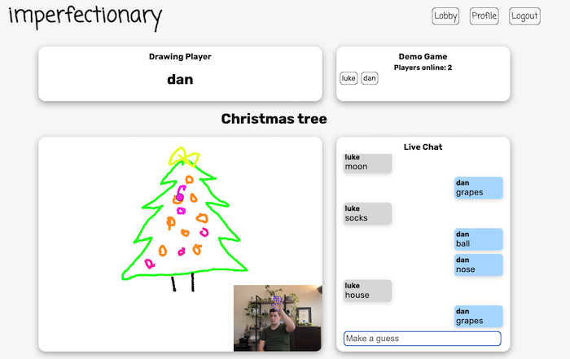
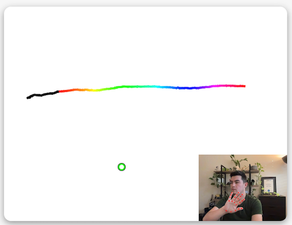

# imperfectionary

imperfectionary is a multiplayer drawing and guessing game that uses the [tensorflow.js hand pose detection](https://github.com/tensorflow/tfjs-models/tree/master/hand-pose-detection) model to track players hand positions and enables them to draw onto a canvas. 

The homepage features a drawing canvas for users to practice on before they start playing with friends.

After signing up/logging in users can create a new game room or join one that is already in progress. 

The player who created the room gets the first go at drawing while all other players try to guess. 

Guessing takes place via a live chat, when a message is detected to contain the secret word all players are notified and a new round is triggered with the correct guesser now the drawing player.      

## Check it out: [imperfectionary](https://imperfectionary.netlify.app/)

### Tech Stack:
- React
- Socket.io
- MongoDB
- Mongoose
- Node 
- Express

## How it works

The video from a users webcam is fed into the handpose model every 16ms which returns an object containing data about all the detections it can find in the video frame. 

This hands data is then fed into a function which marks the keypoints onto a canvas that overlays the video feed on screen. The data is also separated into left and right hands which are then dealt with separatly.

For the right hand: 

If the confidence score provided by handpose is above the threshold.
- The coordinates of the hand within the video frame are passed to the drawing function and also used to position the visual aid marker on the drawing canvas. 
- The rightHand data is processed to extract the 3d keypoints which are fed into the gestureEstimator function provided by the [fingerpose](https://www.npmjs.com/package/fingerpose) library to determine if any of the programmed gestures are present. We are looking for an "open" hand and a "fist".
- If the gestureEstimator returns an open hand, we trigger the startDraw function, which basically just turns the pen on. A fist triggers the stopDraw function which turns off the pen.

For the left hand we are only interested in an open palm.
- The X coordinate of the open palm is mapped to adjust the color of the pen for drawing. 
  - The range 0-140 results in black
  - Between 140-500 the coordinate is mapped to a 0-360 range and provided as the hue value.
  - 500-640 results in white and an increased weight to simulate an eraser.

In a multiplayer game the draw function also triggers a socket.io emit event which sends the canvas  (converted to base64 dataURL format) to all other sockets that are connected to the room. From there those sockets will draw the canvas data onto their own canvas.

*Check out the [backend repo](https://github.com/danyip/imperfectionary-be) for more info about how socket.io is used to communicate the multiplayer game data.* 

## Wishlist
- Resize the canvas to make it mobile responsive
- Add drawing though touch events

